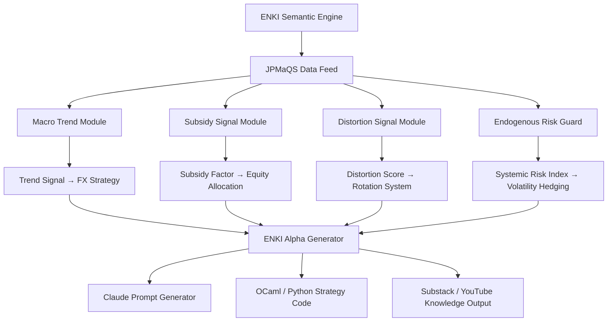

```mermaid
graph TD
A[ENKI Semantic Engine] --> B[JPMaQS Data Feed]
B --> C1[Macro Trend Module]
B --> C2[Subsidy Signal Module]
B --> C3[Distortion Signal Module]
B --> C4[Endogenous Risk Guard]

C1 --> D1[Trend Signal → FX Strategy]
C2 --> D2[Subsidy Factor → Equity Allocation]
C3 --> D3[Distortion Score → Rotation System]
C4 --> D4[Systemic Risk Index → Volatility Hedging]

D1 --> E[ENKI Alpha Generator]
D2 --> E
D3 --> E
D4 --> E
E --> F[Claude Prompt Generator]
E --> G[OCaml / Python Strategy Code]
E --> H[Substack / YouTube Knowledge Output]
```
