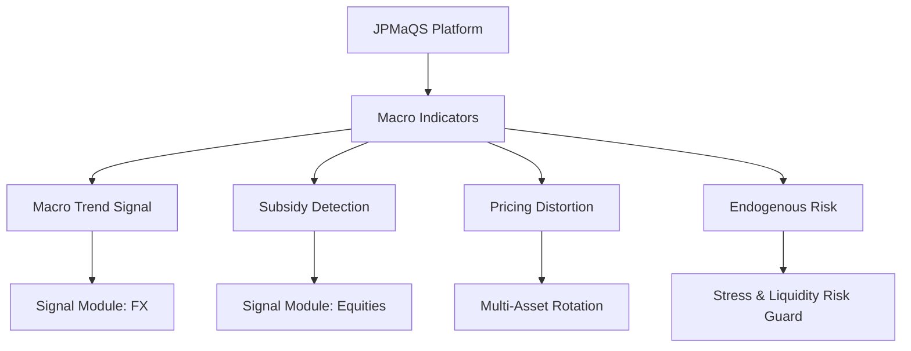

# 🧠 Macro-Quantamental Codex · ENKI | JPMaQS × Strategy Language System

Welcome to the official **Macro-Quant Codex Repository**, a structured knowledge system derived from the _Macro-Quantamental Investment Handbook (2025)_. This Codex provides YAML modules to support:

- Claude/GPT prompt generation
- ENKI AI training
- Ztrader deployment
- Substack/YouTube content creation

---

## 📦 Modules Included

| File | Description |
|------|-------------|
| MQ_Codex_JPMaQS.yaml | JPMaQS macro quant platform (data structure & features) |
| MQ_Codex_ValueMechanism.yaml | Macro alpha generation framework (trend/subsidy/distortion/risk) |
| MQ_Codex_Ch1.yaml – MQ_Codex_Ch8.yaml | Chapter-level strategy knowledge units |

---

## 🧭 Codex System Map



---

## 🛠️ Usage

1. Clone or download ZIP
2. Parse YAML modules into your AI system
3. Feed Prompt to Claude/GPT like:
```
"Design a strategy using macro trend indicators and risk-of-policy error to adjust FX exposures"
```

---

## 📚 Source

Based on: **Macro-Quantamental Investment Handbook** by Macrosynergy (2025)  
System encoded by: ENKI / Claude / Ztrader Semantic Architecture

> “Transform macroeconomic chaos into structured alpha generation”

